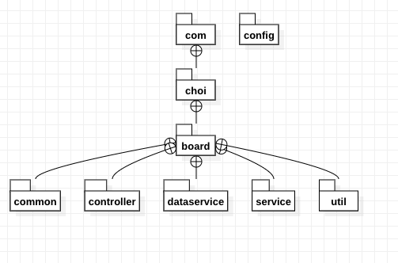
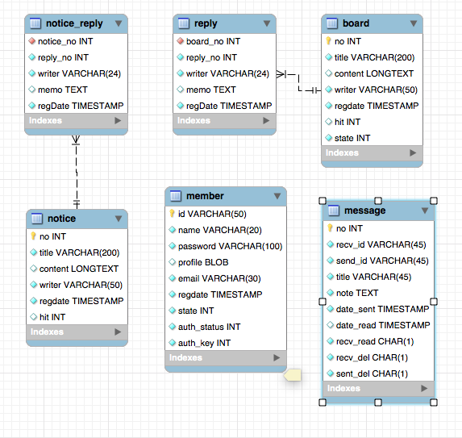

## 미니 프로젝트[http://3.37.252.132/ 비용 문제로 폐쇄하였습니다.]
:scroll: 목차
- [미니 프로젝트[http://http://3.37.252.132/ 비용 문제로 폐쇄하였습니다.]](#미니-프로젝트httphttp337252132)
  - [:bulb: 주제](#bulb-주제)
    - [:hammer_and_wrench: 기능](#hammer_and_wrench-기능)
    - [:computer: 개발환경](#computer-개발환경)
    - [:package: 패키지구조](#package-패키지구조)
    - [:file_cabinet: 테이블구조](#file_cabinet-테이블구조)
    - [:keyboard: &nbsp;sql문](#keyboard-sql문)

### :bulb: 주제
    이 프로젝트는 회원제 댓글 게시판입니다. 
    아마존 웹서비스 ec2 제품을 사용하여 
    언제 어디서든 접속 가능한 서버를 구현하였습니다.
    스프링 모바일을 사용하여 모바일 기기와 웹 브라우저의 뷰를 분리하였습니다.

#### :hammer_and_wrench: 기능
- :family_man_woman_girl_boy: &nbsp;회원
  - `가입`
  - `정보수정(비밀번호, 이메일)`
  - `탈퇴`
  - `db 암호를 운영자도 알 수 없도록`
    `단방향 암호화 함수(md5())로 insert 했습니다.`
- :clipboard: &nbsp;게시판
  - `게시글 작성`
  - `게시글 수정`
  - `게시글 삭제`
- :memo: &nbsp;댓글
  - `댓글 달기`
  - `댓글 삭제하기`
- :mailbox: &nbsp;메시지
  - `타 회원의 아이디를 게시글 목록에서 클릭했을 때 메뉴 띄우기`
  - `메시지 보내기`
  - `수신/발신인 중 한명이 메시지를 삭제했을 때`    
    `삭제하지 않은 사람에게는 메시지가 보이게 하기(db에서 지우지 않습니다.)`
  - `로그인 했을 때 읽지 않은 메시지 뱃지가 표시되게 하기`    
    `(읽고나서 없어지는 것은 적용하지 못하였습니다.)`
- :cop: &nbsp;관리자
  - `글 삭제 권한`
  - `정책위반한 회원 강퇴`
  - `공지사항 작성, 수정, 삭제`
- :unlock: 이메일 인증 & 비밀번호 찾기 :key:
  - `가입시 이메일로 전송된 링크를 누르면 가입 완료`
  - `비밀번호 분실시 임시 비밀번호 메일로 전송`
#### :computer: 개발환경
    
    Server OS : ubuntu
    
    Language : JAVA 1.8
    
    Framework : Spring 5.0.2.RELEASE
    
    WEB Server : Apache
    
    WAS Server : Tomcat 8.5
    
    build tool : maven 3.6.3
    
    DB : MySQL 8.0.27
#### :package: 패키지구조

#### :file_cabinet: 테이블구조

#### :keyboard: &nbsp;sql문

miniproject.sql

~~~ sql
CREATE SCHEMA IF NOT EXISTS `miniproject` 
EFAULT CHARACTER SET utf8mb4 COLLATE utf8mb4_unicode_ci ;
USE `miniproject` ;

-- -----------------------------------------------------
-- Table `miniproject`.`board`
-- -----------------------------------------------------
CREATE TABLE IF NOT EXISTS `miniproject`.`board` (
  `no` INT NOT NULL AUTO_INCREMENT,
  `title` VARCHAR(200) NOT NULL,
  `content` LONGTEXT NULL DEFAULT NULL,
  `writer` VARCHAR(50) NOT NULL,
  `regdate` TIMESTAMP NOT NULL DEFAULT CURRENT_TIMESTAMP,
  `hit` INT NULL DEFAULT '0',
  `state` INT NOT NULL DEFAULT '1', --회원 탈퇴시에 state=3
  PRIMARY KEY (`no`))
ENGINE = InnoDB;

-- -----------------------------------------------------
-- Table `miniproject`.`member`
-- -----------------------------------------------------
CREATE TABLE IF NOT EXISTS `miniproject`.`member` (
  `id` VARCHAR(50) NOT NULL,
  `name` VARCHAR(20) NOT NULL,
  `password` VARCHAR(100) NOT NULL,
  `profile` BLOB NULL DEFAULT NULL,
  `email` VARCHAR(30) NOT NULL,
  `regdate` TIMESTAMP NOT NULL DEFAULT CURRENT_TIMESTAMP,
  `state` INT NOT NULL DEFAULT '1', --작성자 탈퇴시에 state=3
  `auth_status` INT NOT NULL DEFAULT '0',
  `auth_key` INT NOT NULL,
  PRIMARY KEY (`id`))
ENGINE = InnoDB;

-- -----------------------------------------------------
-- Table `miniproject`.`message`
-- -----------------------------------------------------
CREATE TABLE IF NOT EXISTS `miniproject`.`message` (
  `no` INT NOT NULL AUTO_INCREMENT,
  `recv_id` VARCHAR(45) NOT NULL,
  `send_id` VARCHAR(45) NOT NULL,
  `title` VARCHAR(45) NOT NULL,
  `note` TEXT NOT NULL,
  `date_sent` TIMESTAMP NOT NULL,
  `date_read` TIMESTAMP NULL DEFAULT NULL,
  `recv_read` CHAR(1) NOT NULL DEFAULT 'N',
  `recv_del` CHAR(1) NOT NULL DEFAULT 'N',
  `sent_del` CHAR(1) NOT NULL DEFAULT 'N',
  PRIMARY KEY (`no`))
ENGINE = InnoDB;

-- -----------------------------------------------------
-- Table `miniproject`.`notice`
-- -----------------------------------------------------
CREATE TABLE IF NOT EXISTS `miniproject`.`notice` (
  `no` INT NOT NULL AUTO_INCREMENT,
  `title` VARCHAR(200) NOT NULL,
  `content` LONGTEXT NULL DEFAULT NULL,
  `writer` VARCHAR(50) NOT NULL DEFAULT '관리자',
  `regdate` TIMESTAMP NOT NULL DEFAULT CURRENT_TIMESTAMP,
  `hit` INT NULL DEFAULT '0',
  PRIMARY KEY (`no`))
ENGINE = InnoDB;

-- -----------------------------------------------------
-- Table `miniproject`.`notice_reply`
-- -----------------------------------------------------
CREATE TABLE IF NOT EXISTS `miniproject`.`notice_reply` (
  `notice_no` INT NOT NULL,
  `reply_no` INT NOT NULL,
  `writer` VARCHAR(24) NOT NULL,
  `memo` TEXT NULL DEFAULT NULL,
  `regDate` TIMESTAMP NOT NULL DEFAULT CURRENT_TIMESTAMP,
  INDEX `notice_no` (`notice_no` ASC) VISIBLE,
  CONSTRAINT `notice_reply_ibfk_1`
    FOREIGN KEY (`notice_no`)
    REFERENCES `miniproject`.`notice` (`no`)
    ON UPDATE CASCADE)
ENGINE = InnoDB;

-- -----------------------------------------------------
-- Table `miniproject`.`reply`
-- -----------------------------------------------------
CREATE TABLE IF NOT EXISTS `miniproject`.`reply` (
  `board_no` INT NOT NULL,
  `reply_no` INT NOT NULL,
  `writer` VARCHAR(24) NOT NULL,
  `memo` TEXT NULL DEFAULT NULL,
  `regDate` TIMESTAMP NOT NULL DEFAULT CURRENT_TIMESTAMP,
  INDEX `board_no` (`board_no` ASC) VISIBLE,
  CONSTRAINT `reply_ibfk_1`
    FOREIGN KEY (`board_no`)
    REFERENCES `miniproject`.`board` (`no`)
    ON UPDATE CASCADE)
ENGINE = InnoDB;
~~~

